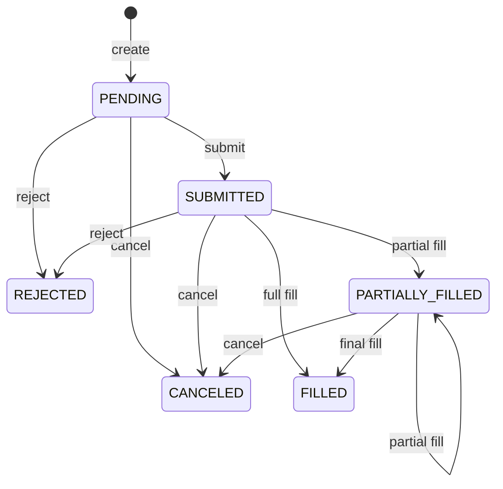

# Order lifecycle

The broker-independent `OrderEngine` converts approved or resized
`RiskDecision` objects plus immutable `ExecutionInstruction` details into
`OrderRequest` and `Order` snapshots. It manages lifecycle state, accepted fill
history, and a lightweight audit-event sequence. It does not submit orders to a
broker or simulate fills.

`OrderRequest.submitted_at` represents request creation time in this version.
Actual broker submission time is recorded by the `SUBMITTED` lifecycle event.
Creation must occur no earlier than risk evaluation, which must occur no
earlier than proposal creation. Every later event timestamp must be greater
than or equal to the latest successful event timestamp for that order.



`FILLED`, `CANCELED`, and `REJECTED` are terminal. Partially filled orders may
be canceled but not rejected. Each successful transition replaces the current
immutable `Order`; individual `OrderFill` objects remain in a separate ordered
history so aggregate order state does not duplicate ledger accounting.

Fills require a managed submitted or partially filled order, matching order
identity, symbol, and side, a globally new fill ID, valid chronology, and a
quantity no greater than the remainder. Average price is calculated as:

```text
(previous quantity * previous average + fill quantity * fill price)
/ new total quantity
```

Orders, events, and fills have globally unique IDs within their respective
collections. Events form one global application-ordered sequence; per-order
queries filter it without changing order. All validation and construction
complete before state is committed, so failures append no fill or event and
change no order.

The engine does not manage cash, positions, buying power, cost basis, profit
and loss, risk sizing, market data, strategy signals, AI, persistence, or real
broker connectivity. Future orchestration must revalidate price, cash,
positions, and limits immediately before actual submission. The paper ledger
independently consumes accepted fills.
